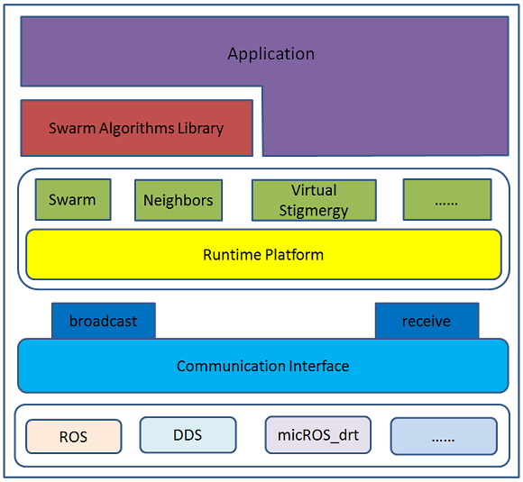
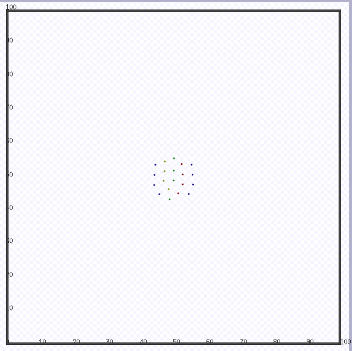
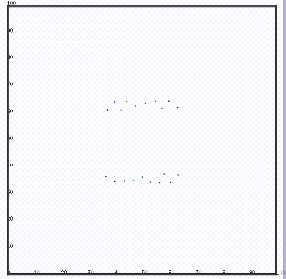

## Introduction
micros_swarm_framework is a programming framework to facilitate application development involving robot swarms. It makes coding for swarms much easier by providing an adequate swarm-level abstraction, as well as tools for swarm management, various communication mechanisms and so on. Enlightened by the Buzz programming language for robot swarms, micros_swarm_framework also provides essential data structures, such as Neighbor, Swarm, and Virtual Stigmergy, to the user. Most importantly, it is completely compatible with ROS Indigo and presented in the form of a C++ library, which means that all resources in the ROS ecosystem are still available to the user. It is currently compatible with ROS Indigo, and is also extensible to Opensplice DDS.

## Architecture
In order to make it modular and extensible, we chose to decompose the framework into a layered structure, as shown in Fig. 1. The Communication Interface layer is to implement an abstraction of the underlying communication mechanisms, and provides a set of unified interface to layer above. At the core of the framework is a runtime platform, based on which APIs including abstract data structures, such as Swarm, Neighbor, and Virtual Stigmergy, are provided to the user. Upon this core part, we are also trying to build a library of typical swarm algorithms to further facilitate the application development.

ROS wiki:  http://wiki.ros.org/micros_swarm_framework

## Simulation
#### Motion and Spatial Coordination

#### Separation into Multiple Swarms

#### Flocking

